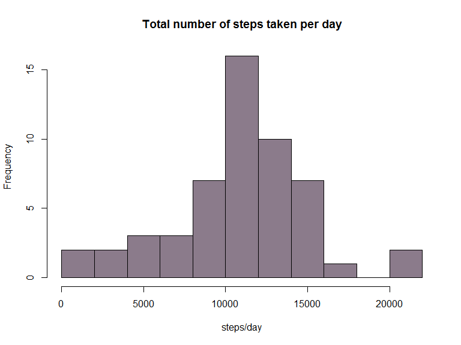

# Reproducible Research: Peer Assessment 1


## Loading and preprocessing the data


```r
if(!file.exists("./data")){dir.create("./data")}
unzip("activity.zip", exdir = "./data")
(files <- list.files("./data", full.names=T))
```

```
## [1] "./data/activity.csv"
```

```r
dat <- read.csv(files[1], na.strings="NA")

head(dat)
```

```
##   steps       date interval
## 1    NA 2012-10-01        0
## 2    NA 2012-10-01        5
## 3    NA 2012-10-01       10
## 4    NA 2012-10-01       15
## 5    NA 2012-10-01       20
## 6    NA 2012-10-01       25
```

```r
tail(dat)
```

```
##       steps       date interval
## 17563    NA 2012-11-30     2330
## 17564    NA 2012-11-30     2335
## 17565    NA 2012-11-30     2340
## 17566    NA 2012-11-30     2345
## 17567    NA 2012-11-30     2350
## 17568    NA 2012-11-30     2355
```

```r
str(dat)
```

```
## 'data.frame':	17568 obs. of  3 variables:
##  $ steps   : int  NA NA NA NA NA NA NA NA NA NA ...
##  $ date    : Factor w/ 61 levels "2012-10-01","2012-10-02",..: 1 1 1 1 1 1 1 1 1 1 ...
##  $ interval: int  0 5 10 15 20 25 30 35 40 45 ...
```

```r
### change the date variable into class=date
dat$date <- as.Date(as.character(dat$date), "%Y-%m-%d")

## change steps variable into numeric
dat$steps <- as.numeric(dat$steps)
str(dat)
```

```
## 'data.frame':	17568 obs. of  3 variables:
##  $ steps   : num  NA NA NA NA NA NA NA NA NA NA ...
##  $ date    : Date, format: "2012-10-01" "2012-10-01" ...
##  $ interval: int  0 5 10 15 20 25 30 35 40 45 ...
```


## What is mean total number of steps taken per day?

For this part of the assignment, you can ignore the missing values in the dataset.

1. Make a histogram of the total number of steps taken each day

2. Calculate and report the mean and median total number of steps taken per day


```r
library(dplyr)
```

```
## 
## Attaching package: 'dplyr'
## 
## The following object is masked from 'package:stats':
## 
##     filter
## 
## The following objects are masked from 'package:base':
## 
##     intersect, setdiff, setequal, union
```

```r
stepsPerDay <- 
        dat %>%
        group_by(date) %>%
        summarize(totalSteps = sum(steps, na.rm = T))
```


```r
with(stepsPerDay, hist(totalSteps, breaks = "FD", main ="Total number of steps taken per day", xlab = "steps/day", col = "thistle4"))
```

 


```r
totalStepsPerDaysummary <- 
        stepsPerDay %>%
        summarize(mean = mean(totalSteps),
                  median = median(totalSteps))
```

The **mean** total number of steps per day is 9354.23

The **median** total number of steps per day is 1.0395\times 10^{4}

## What is the average daily activity pattern?

1. Make a time series plot (i.e. type = "l") of the 5-minute interval (x-axis) and the average number of steps taken, averaged across all days (y-axis)

2. Which 5-minute interval, on average across all the days in the dataset, contains the maximum number of steps?


```r
library(dplyr)

stepsPerInterval <- 
        dat %>%
        group_by(interval) %>%
        summarize(avgNumSteps = mean(steps, na.rm = T))
```


```r
with(stepsPerInterval, plot(interval, avgNumSteps, xlab="5 minute intervals", ylab="Average number of steps taken", main="Time series plot of the average number of steps taken\n at each of the 2355 5-min-intervals", type="l"))
```

 


```r
maxSteps <- which.max(stepsPerInterval$avgNumSteps)
maxInterval <- stepsPerInterval$interval[maxSteps]
```

The **835th** interval contains, on average across all the days, the maximum number of steps.


## Imputing missing values

1. Calculate and report the total number of missing values in the dataset (i.e. the total number of rows with NAs)


```r
totalNAs <- sum(is.na(dat))
```

There are in total 2304 missing values in the dataset.

2. Devise a strategy for filling in all of the missing values in the dataset. The strategy does not need to be sophisticated. For example, you could use the mean/median for that day, or the mean for that 5-minute interval, etc.

3. Create a new dataset that is equal to the original dataset but with the missing data filled in.


```r
### use average number of steps for each 5-min interval to replace missing values in the 'steps' variable

tblDat <- tbl_df(dat) %>%
        group_by(interval) %>%
        mutate(imputed = mean(steps, na.rm=T))

tblDat$steps[is.na(tblDat$steps)] <- tblDat$imputed[is.na(tblDat$steps)]
head(tblDat)
```

```
## Source: local data frame [6 x 4]
## Groups: interval
## 
##       steps       date interval   imputed
## 1 1.7169811 2012-10-01        0 1.7169811
## 2 0.3396226 2012-10-01        5 0.3396226
## 3 0.1320755 2012-10-01       10 0.1320755
## 4 0.1509434 2012-10-01       15 0.1509434
## 5 0.0754717 2012-10-01       20 0.0754717
## 6 2.0943396 2012-10-01       25 2.0943396
```

4. Make a histogram of the total number of steps taken each day and calculate and report the mean and median total number of steps taken per day. Do these values differ from the estimates from the first part of the assignment? What is the impact of imputing missing data on the estimates of the total daily number of steps?


```r
stepsPerDayNew <- 
        tblDat %>%
        group_by(date) %>%
        summarize(totalSteps = sum(steps, na.rm = T))
```


```r
par(mfrow=c(1,2))
with(stepsPerDayNew, hist(totalSteps, main ="Total number of steps per day\n (missing values imputed from mean per interval)", xlab = "steps/day", col = "thistle4"))
with(stepsPerDay, hist(totalSteps, main ="Total number of steps per day", xlab = "steps/day", col = "thistle4"))
```

 


```r
stepsPerDayNewSummary <- summarize(stepsPerDayNew, mean = mean(totalSteps), median = median(totalSteps))
```

The mean and median total number of steps for this new data is 1.076619\times 10^{4} and 1.076619\times 10^{4}, respectively. Imputing missing values increased the estimates of mean and median. Also, the distribution of steps per day is closer to normal distribution. 

## Are there differences in activity patterns between weekdays and weekends?

1. Create a new factor variable in the dataset with two levels – “weekday” and “weekend” indicating whether a given date is a weekday or weekend day.

2. Make a panel plot containing a time series plot (i.e. type = "l") of the 5-minute interval (x-axis) and the average number of steps taken, averaged across all weekday days or weekend days (y-axis). See the README file in the GitHub repository to see an example of what this plot should look like using simulated data.


```r
tblDat2 <- select(tblDat, steps:interval) 
test <- weekdays(tblDat2$date) %in% c("Saturday", "Sunday")
tblDat2$dayType <- as.factor(ifelse(test, "weekend", "weekday"))
head(tblDat2) 
```

```
## Source: local data frame [6 x 4]
## Groups: interval
## 
##       steps       date interval dayType
## 1 1.7169811 2012-10-01        0 weekday
## 2 0.3396226 2012-10-01        5 weekday
## 3 0.1320755 2012-10-01       10 weekday
## 4 0.1509434 2012-10-01       15 weekday
## 5 0.0754717 2012-10-01       20 weekday
## 6 2.0943396 2012-10-01       25 weekday
```

```r
str(tblDat2$dayType)
```

```
##  Factor w/ 2 levels "weekday","weekend": 1 1 1 1 1 1 1 1 1 1 ...
```

```r
### create new data grouped by interval and by dayType

tblDat3 <- tblDat2 %>%
        group_by(interval, dayType) %>%
        summarize(mean=mean(steps))
```


```r
par(mfrow = c(2, 1), mar = c(4, 6, 2, 1.5), oma = c(1, 1, 1, 1))
weekdayDat <- subset(tblDat3, dayType=="weekday")
weekendDat <- subset(tblDat3, dayType=="weekend")
with(weekdayDat, plot(interval, mean, xlab="5 minute intervals", ylab="Average number of\n steps taken", main="Average number of steps per interval on weekdays", type="l"))
with(weekendDat, plot(interval, mean, xlab="5 minute intervals", ylab="Average number of\n steps taken", main="Average number of steps per interval on weekends", type="l"))
```

 

